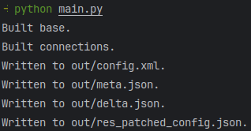
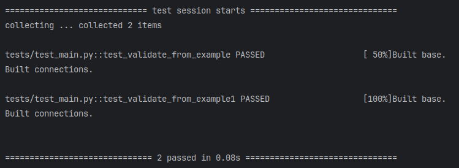

# Impulse Telecom

## Run

Install dependencies with poetry and execute program:
```bash
poetry install
poetry run main
```

Or use python directly:
```bash
python main.py
```

Sample result:



## Development

Install dependencies with poetry:
```bash
poetry install
```

Setup pre-commit rules for git:
```bash
poetry env activate
pre-commit install
```

Run pytests:
```bash
poetry run pytest -v -s
```

Sample result:

